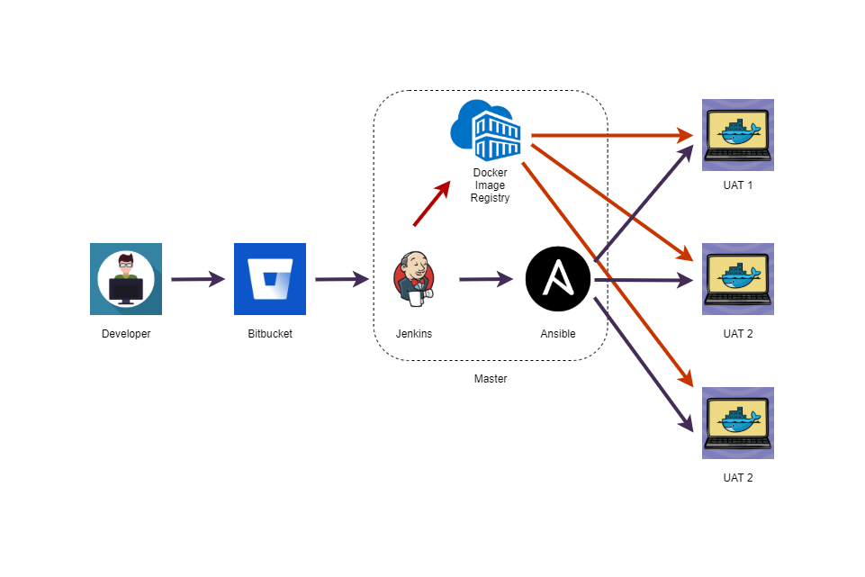

# Docker container deployment with Jenkins and Ansible

### Why we need this setup?

* Single point of deployment

* Less time to deployments and focus more on development

* No need to SSH to different servers time to time (loosely couple slave nodes from master)

* Easy replication of environments i.e. identical nodes

* Binding multiple phases i.e. testing phase

* Flexible configuration of pipelines

### Deployment Architecture

### What we are going to do ?

1. Create a simple pipeline to deploy `Hello Service`

2. Create a parameterized pipeline to deploy `Hello Service`

3. Create a generic service build pipeline

4. Create a generic service deployment pipeline

5. Create a parameterized pipeline to clean environments

